  
  &nbsp;
  

  

## About Me
I'm a developer driven by the thrill of problem-solving — whether it's building something from scratch or architecting clean, well-structured solutions. I believe your workspace is a mirror of your mind, so I keep both organized. Code isn't just work for me, it's a craft, and I take pride in writing it with intention and clarity. When I step away from the keyboard, you'll find me lost in music or counting down the minutes until I can get moving — any sport, any season. That balance between the precision of coding and the freedom of creativity and movement is what keeps me sharp. 

## Tech Stack

  <table>
    <tr>
      <th>Languages</th>
      <th>DevOps & OS</th>
      <th>Editors & Tools</th>
    </tr>
    <tr>
      <td>
        
      </td>
      <td>
        
          
        
      </td>
      <td>
        
          
        
        
      </td>
    </tr>
  </table>

## 42 Lisbon

  <table>
    <tr>
      <th>Project</th>
      <th>Concepts</th>
      <th>Grade</th>
    </tr>
    <tr>
      <td><b><a href="https://github.com/Msdmrf/42-Lisbon-Common-Core-Libft">Libft</a></b></td>
      <td>C Standard Library Recreation · String & Memory Manipulation · Linked List Operations</td>
      <td>125/100 ⭐</td>
    </tr>
    <tr>
      <td><b><a href="https://github.com/Msdmrf/42-Lisbon-Common-Core-get_next_line">Get Next Line</a></b></td>
      <td>File Descriptor Management · Static Variables · Buffered Reading · Dynamic Memory Allocation</td>
      <td>125/100 ⭐</td>
    </tr>
    <tr>
      <td><b><a href="https://github.com/Msdmrf/42-Lisbon-Common-Core-Born2beroot">Born2beroot</a></b></td>
      <td>Linux System Administration · Virtualization · SSH & Firewall Configuration · User & Group Policies · Bash Monitoring Scripts</td>
      <td>125/100 ⭐⭐</td>
    </tr>
    <tr>
      <td><b><a href="https://github.com/Msdmrf/42-Lisbon-Common-Core-ft_printf">Printf</a></b></td>
      <td>Variadic Functions · Format String Parsing · Type Conversion (Integer, Hex, Pointer) · Modular Output Handling</td>
      <td>100/100 ⭐⭐</td>
    </tr>
    <tr>
      <td><b><a href="https://github.com/Msdmrf/42-Lisbon-Common-Core-push_swap">Push Swap</a></b></td>
      <td>Algorithm Optimization · Stack-Based Sorting · Bitwise Radix Sort · Complexity Reduction</td>
      <td>90/100 ⭐</td>
    </tr>
    <tr>
      <td><b><a href="https://github.com/Msdmrf/42-Lisbon-Common-Core-so_long">So Long</a></b></td>
      <td>2D Game Development · MiniLibX Graphics · Tile-Based Map Rendering · Pathfinding Validation (Flood Fill) · Sprite Animation</td>
      <td>125/100 ⭐⭐⭐</td>
    </tr>
    <tr>
      <td><b><a href="https://github.com/Msdmrf/42-Lisbon-Common-Core-pipex">Pipex</a></b></td>
      <td>Unix Pipelines · Process Creation (fork/exec) · File Descriptor Redirection · PATH Resolution · Error Management</td>
      <td>100/100 ⭐</td>
    </tr>
    <tr>
      <td><b><a href="https://github.com/Msdmrf/42-Lisbon-Common-Core-minishell">Minishell</a></b></td>
      <td>Shell Reimplementation · Lexing & Parsing · Built-in Commands · Pipes & Redirections · Heredoc · Signal Handling · Process Management</td>
      <td>101/100 ⭐⭐⭐</td>
    </tr>
    <tr>
      <td><b><a href="https://github.com/Msdmrf/42-Lisbon-Common-Core-Philosophers">Philosophers</a></b></td>
      <td>Multithreading (pthreads) · Mutex Synchronization · Deadlock & Starvation Prevention · Multiprocessing · Semaphore Management</td>
      <td>125/100 ⭐⭐</td>
    </tr>
  </table>

## Contact Info

  
  &nbsp;
  
  &nbsp;
  

